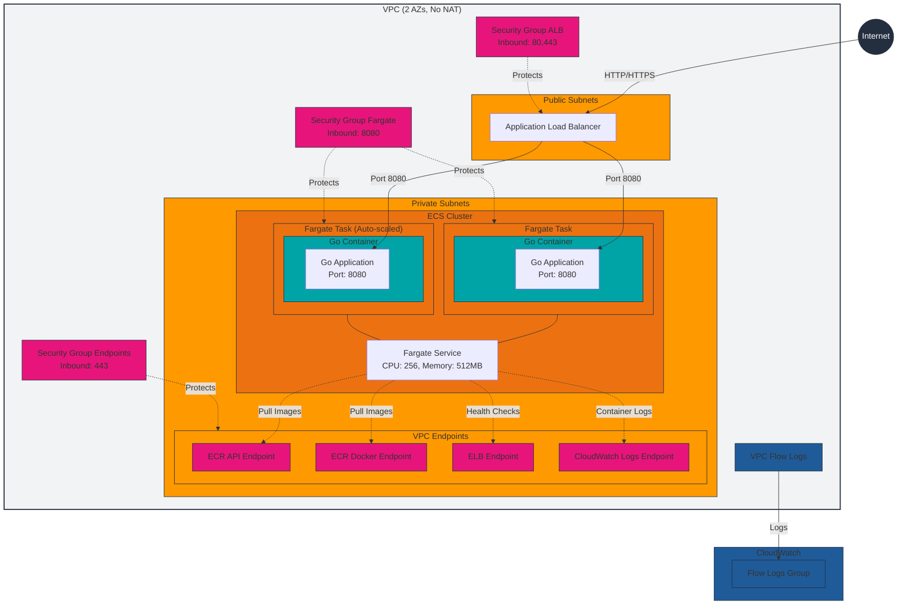
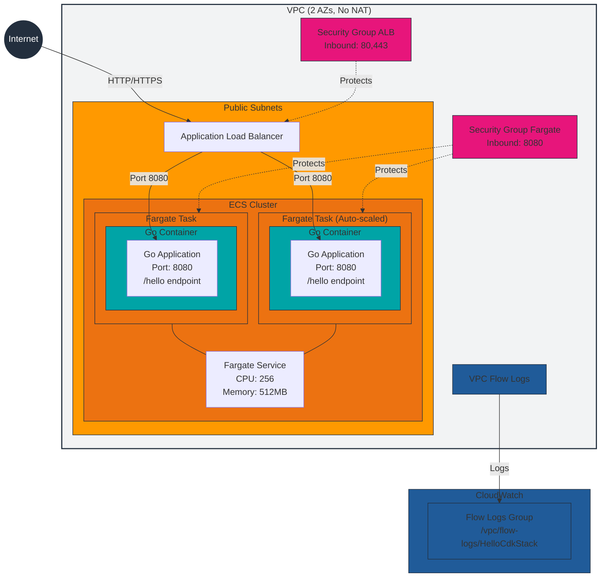

# Hello CDK Stack

This repository contains two versions of the **Hello CDK Stack**, designed for different networking configurations and use cases.

## Versions

### **1. VPC Endpoints Version**
- **Description**:
  - Utilizes VPC Interface Endpoints for secure, private communication with AWS services (e.g., ECR, CloudWatch Logs) within the VPC.
  - Keeps all network traffic within the AWS network backbone, enhancing security and reducing internet exposure.
  - Suitable for use cases requiring stricter security and private connections.
- **Trade-offs**:
  - Fixed costs for VPC endpoints (~$7/month per endpoint).
  - Requires additional setup for VPC endpoint configurations.
  - Costs may exceed NAT gateway (not featured in this project at this time) costs for high number of endpoints.
  - Outbound data transfer costs within AWS are generally lower than when using public internet access.
    - Can be more cost effective for high volume use cases.

See [AWS PrivateLink Pricing](https://aws.amazon.com/privatelink/pricing/) for detailed costs:

#### Diagram


### **2. Public Access Version**
- **Description**:
  - Uses public internet access for all external communications.
  - Assigns public IPs to ECS tasks and routes traffic directly to external services without VPC endpoints.
  - Simplifies setup and reduces fixed costs by avoiding VPC endpoint charges.
- **Trade-offs**:
  - Outbound data transfer costs may be higher than with VPC endpoints.
  - Public-facing IPs require strict security group configurations.

See [AWS Data Transfer Pricing](https://aws.amazon.com/blogs/architecture/overview-of-data-transfer-costs-for-common-architectures/) for detailed costs.

#### Diagram


## File Structure

### Root Directory
The root directory contains microservice-related files:
- **`Dockerfile`**: Used to containerize the microservice.
- **`main.go`**: Entry point for the microservice.
- Other configuration files: Refer to the [AWS CDK documentation](https://docs.aws.amazon.com/cdk/v2/guide/bootstrapping-env.html) for details on `cdk.json` and other CDK-related files.

### `lib` Directory
The `lib` directory contains the main stack files for both versions:
- **`hello-cdk-stack.ts`**: The CDK stack implementation.

## Deployment Instructions
Each version of the stack configuration is managed on separate branches:
- **`main` branch**: Contains the VPC Endpoints Version.
- **`public-access` branch**: Contains the Public Access Version.

### Installing and Configuring AWS CDK
1. **Install AWS CDK**:
   - Ensure Node.js (v16 or later) is installed.
   - Install the AWS CDK CLI globally:
     ```bash
     npm install -g aws-cdk
     ```

2. **Install Project Dependencies**:
   - Run the following command to install necessary development dependencies for TypeScript and Node.js type definitions:
     ```bash
     npm install -D @types/node typescript
     ```

3. **Bootstrap Your AWS Environment**:
   - If you haven’t already, bootstrap your AWS environment:
     ```bash
     cdk bootstrap
     ```
   - This step is required only once per AWS account and region. If your AWS CLI is already configured, this step will use your default credentials. Refer to the [AWS CDK documentation](https://docs.aws.amazon.com/cdk/latest/guide/bootstrapping.html) for more details.

4. **Verify the Installation**:
   - Confirm the CDK CLI is installed:
     ```bash
     cdk --version
     ```

### Steps to Deploy
1. Check out the branch for the desired version:
   ```bash
   git checkout main           # For VPC Endpoints Version
   git checkout public-access  # For Public Access Version
   ```

2. Ensure all necessary dependencies are installed:
   ```bash
   npm install
   ```

3. Deploy the stack using AWS CDK:
   ```bash
   cdk deploy
   ```

Ensure your AWS account has the appropriate permissions and that AWS CDK is configured correctly. Refer to the [AWS CDK documentation](https://docs.aws.amazon.com/cdk/latest/guide/work-with-cdk.html) for more details.

1. **Access the Microservice**:
   - After deployment, the CDK CLI will output the URL of the ALB. Access the microservice using this URL.
   - For either version, you can test the `/hello` endpoint with the following command:
     ```bash
     curl 'http://<ALB DNS>/hello?name=my%20beautiful%20friend'
     ```
     
---

For more details on each version, refer to the respective `lib/hello-cdk-stack.ts` file in the branch.
